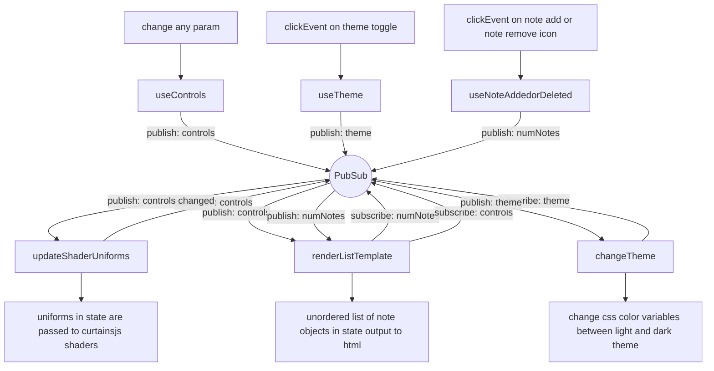

```mermaid

graph TD;

	A[useControls] --> |publish: controls| B((PubSub));

	D[useTheme] --> |publish: theme| B

	G[useNoteAddedorDeleted] --> |publish: numNotes| B;

	E[updateShaderUniforms] --> |subscribe: controls| B;

	B --> |publish: controls changed| E;
	
	
	F[renderListTemplate] --> |subscribe: numNotes| B;
	
	F --> |subscribe: controls| B
	
	B --> |publish: controls| F;

	B --> |publish: numNotes| F;

	H[changeTheme] --> |subscribe: theme| B;

	B --> |publish: theme| H;

	I[change any param] --> A;

	J[clickEvent on theme toggle] --> D;

	K[clickEvent on note add or note remove icon] --> G;

	E --> L[uniforms in state are passed to curtainsjs shaders];

	F --> M[unordered list of note objects in state output to html];

	H --> N[change css color variables between light and dark theme];
	
```