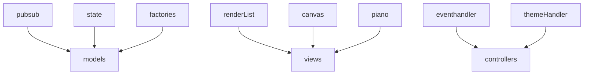

```mermaid
graph TD;

	A[models]
	B[views]
	C[controllers]
	
	D[pubsub]-->A
	E[state]-->A
	F[factories]-->A
	G[renderList]-->B
	H[canvas]-->B
	I[piano]-->B
	J[eventhandler]-->C
	K[themeHandler]-->C
	
	
```